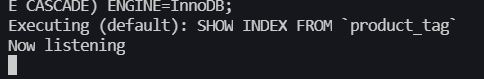

# E-Commerce-Back-End-App
## Link to a Walk-Through Video
https://www.youtube.com/watch?v=ZbeESDDV4UY

## Begin Using This Application
To begin using this application you will need to open the terminal in the root folder. Then you need to proceed to opening the SQL terminal with "mysql -u root -p" and then enter your sql password.

## Sourcing The Database
Once you have the mysql terminal open you need to create the database. To do so you need to run the schema file. To do so you need to type "source ./db/schema.sql;" This will delete any existing database if it exists and create the new one.

## Seeding data into the database
Once you have the database created you need to seed the data into the database to do this you need to navigate out of the mysql terminal and return to your normal terminal. Once there you need to type "npm run seed" this will seed all of the data into your database.

## Starting the Application
Now that you have created the Database and Seeded the data into it you are now ready to use the application.

**Note** You will need to use the Insomnia App to use this so make sure you have that open. 

To start the server you need to be in your normal terminal in the root folder. Type "npm start" or "node server.js" to start the server. After that you will see the message at the bottom "Now Listening".

## Using the Application Through Insomnia
### Get Categories
Now that the server is up and running you will need to go to your Insomnia App. Let's start with getting the Categories data. To get all of the Categories data you will need to do a "GET" call on the following route "localhost:3001/api/categories". You will then see all of the Categories data appear.

Next we want to get a Category by a specific ID. You will need to do a "GET" call on the following route "localhost:3001/api/categories/ID" in this case we are going to replace ID with 1 for an example. So our route will look like this "localhost:3001/api/categories/1"

### Post, Creating a New Category
Now let's move on to creating a new Category. To do this you will need to make a "POST" call to the database using the following route "localhost:3001/api/categories". To add the data you will need to add it in JSON format, the following screenshot below will show you what it looks like when you do this.

### Updating an Existing Category
To update an existing Category you will need to have the Category ID. You can do this by making a "GET" Call like we went over before to see the list of all the Categories. To update an existing Category you will need to make a "PUT" call on the database with the following route "localhost:3001/api/categories/ID". For example's sake we are going to update the Category we created before with the following route "localhost:3001/api/categories/6", you will need to add the data in JSON format. The following screenshot below will show you what this looks like. You can see if this was successful by making a "GET" call like we did before and see the updated data.

### Deleting an Existing Category
To delete an existing Category you will need to have the Category ID. You can do this by making a "GET" call like we did before. To delete an existing Category you need to make a "DELETE" call to the database using the following route "localhost:3001/api/categories/ID". For example's sake we will use the Category we created and updated before using the following route "localhost:3001/api/categories/6". Once done you can make a "GET" call like we did before to confirm it was deleted. The following screenshot below will show what deleting the category looks like.

## For Tags and Product
You may follow the same instructions as Category for Tags and Product. In the route just replace categories with either tags or products. For example for tags "GET" call we will use "localhost:3001/api/tags" and for products "GET" call we will use "localhost:3001/api/products".

### The only difference
The only difference is going to be for Creating a New Product and Updating an Existing Product. We will go over that now.

### Creating a New Product
To create a new product you will need to make a "POST" call to the database with the following route "localhost:3001/api/products". You will need to add the data you want in JSON format. The following screenshot below will show an example. Note that the tagIds section is assigning this product to different tags. To check the newly created product make a "GET" call to the database.

### Updating an Existing Product
To update an existing product you will need to make a "PUT" call to the database with the following route "localhost:3001/api/products/ID". For example's sake we are going to update the product we just created with the route "localhost:3001/api/products/6". Again you will need to add the data in JSON format. The following screenshot below will show us updating the Product. To check the updated product make a "GET" call to the database.

### Finishing Statements
You are now ready to use this application as you see fit! Please keep in mind if you missed this part and need to know how to make calls on tags or products please follow the Categories section on how to do it.

